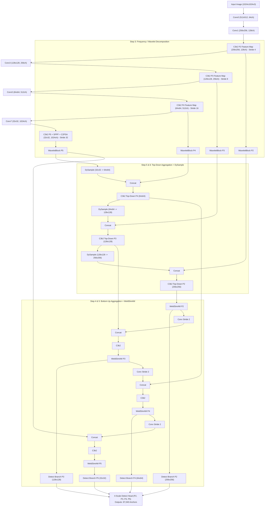

# Weld-YOLO11-SO: Multi-Scale Frequency-Attention YOLO for Industrial Welding Defect Detection

[](https://pytorch.org/)
[](https://github.com/ultralytics/ultralytics)
[](https://github.com/)
[](LICENSE)

**Weld-YOLO11-SO** is a high-precision, deep learning framework engineered specifically for **small industrial welding defect detection** (e.g., porosity, micro-cracks, lack of fusion, burn-through, and surface pinholes). By incorporating frequency-domain wavelet decomposition, directional energy attention, dynamic dynamic upsampling, and 4-scale multi-level feature pyramid fusion ($P_2, P_3, P_4, P_5$), Weld-YOLO11-SO dramatically improves small defect sensitivity on high-resolution industrial welding images ($1024 \times 1024$).

---

## 🛠️ Key Architectural Innovations

1. **High-Resolution $P_2$ Spatial Feature Branch**
   * Adds an early high-resolution feature level ($256 \times 256$ spatial resolution at Stride 4 for $1024 \times 1024$ inputs).
   * Generates **87,040 prediction anchors** across 4 scales ($P_2, P_3, P_4, P_5$), boosting tiny defect recall.

2. **WaveletBlock (WID-YOLO11 Frequency Feature Decomposition)**
   * Differentiable 2D Discrete Haar Wavelet Transform (`haar_dwt2d` / `haar_idwt2d`).
   * Decomposes feature maps into 4 sub-bands ($LL, LH, HL, HH$) to preserve high-frequency welding surface textures and micro-edges without spatial detail loss.
   * Includes lightweight Frequency/Channel Attention for sub-band feature enhancement.

3. **WeldSimAM (Directional & 3D Energy Attention)**
   * Parameter-free 3D SimAM energy attention combined with horizontal ($H$) and vertical ($V$) directional feature pooling.
   * Aligns feature attention along weld seam trajectories and isolates isolated defect pixels.

4. **AHSFPN (Adaptive Hybrid Spatial Feature Pyramid Network)**
   * Dual-path Top-Down ($P_5 \rightarrow P_4 \rightarrow P_3 \rightarrow P_2$) and Bottom-Up ($P_2 \rightarrow P_3 \rightarrow P_4 \rightarrow P_5$) feature aggregation.
   * Uses learnable softmax adaptive fusion weights to balance spatial detail and high-level semantic context.

5. **DySample (Dynamic Content-Aware Upsampling)**
   * Lightweight point-sampling upsampler based on PyTorch `F.grid_sample()`.
   * Replaces static nearest/bilinear interpolation to reconstruct sharp defect boundaries during upsampling.

6. **EnNWD Loss (Enhanced Normalized Wasserstein Distance)**
   * Models bounding boxes as 2D Gaussian distributions $N(\mathbf{\mu}, \mathbf{\Sigma})$.
   * Provides scale-invariant loss optimization for extremely small defects where IoU suffers from spatial instability.

---

## 📐 Complete Model Architecture Diagram



---

## 📈 7-Stage Incremental Architecture Pipeline

Weld-YOLO11-SO is built through a 7-stage progressive enhancement design:

$$\text{YOLO11 Baseline} \xrightarrow{+P_2} P_2 \text{ Branch} \xrightarrow{+\text{Wavelet}} \text{WaveletBlock} \xrightarrow{+\text{WeldSimAM}} \text{WeldSimAM} \xrightarrow{+\text{AHSFPN}} \text{AHSFPN} \xrightarrow{+\text{DySample}} \text{DySample} \xrightarrow{+\text{EnNWD}} \text{EnNWD Loss}$$

| Stage | Module Added | Function & Industrial Benefit |
| :--- | :--- | :--- |
| **Step 1** | **YOLO11 Baseline** | Core C3k2 backbone, SPPF, and C2PSA attention modules. |
| **Step 2** | **$+ P_2$ Spatial Layer** | Adds early high-resolution feature maps ($256 \times 256$ @ Stride 4) for micro-defects. |
| **Step 3** | **$+ \text{WaveletBlock}$** | 2D Haar DWT ($LL, LH, HL, HH$) preserves high-frequency welding surface details. |
| **Step 4** | **$+ \text{WeldSimAM}$** | Directional horizontal/vertical pooling + 3D SimAM energy attention along weld seams. |
| **Step 5** | **$+ \text{AHSFPN}$** | Dual Top-Down & Bottom-Up feature fusion with adaptive weight learning. |
| **Step 6** | **$+ \text{DySample}$** | Dynamic grid sampling replaces static interpolation for sharp edge restoration. |
| **Step 7** | **$+ \text{EnNWD Loss}$** | Bounding box 2D Gaussian Wasserstein distance loss for scale-invariant regression. |

---

## 📁 Repository Structure

```text
Weld-YOLO11-SO/
├── models/
│   ├── weld_yolo11.yaml            # Complete 4-scale YOLO model definition (P2-P5)
│   └── modules/
│       ├── __init__.py             # Custom module exports & registration helper
│       ├── wavelet.py              # WaveletBlock (2D Haar DWT + Freq Attention)
│       ├── weldsimam.py            # WeldSimAM (Directional + 3D SimAM Attention)
│       ├── dysample.py             # DySample (Content-aware grid sampling)
│       ├── ahsfpn.py               # AHSFPN (Adaptive multi-scale feature fusion)
│       └── ennwd_loss.py           # EnNWD (Enhanced Normalized Wasserstein Loss)
├── modules/                        # Synced package module directory
├── register.py                     # Ultralytics environment patch script
├── train_mnist.py                  # 3-Epoch MNIST testing script
├── tests/
│   ├── test_modules.py             # PyTorch module forward/backward unit tests
│   ├── test_model_build.py         # End-to-end model construction test
│   └── test_train_pipeline.py      # Synthetic training pipeline test
└── README.md                       # Project documentation
```

---

## 📊 Dataset Classes (`nc: 3`)

| Class ID | Class Name | Description |
| :--- | :--- | :--- |
| `0` | **Bad Weld** | Poor weld seam geometry, lack of penetration, or excessive burn-through. |
| `1` | **Good Weld** | Structurally sound weld bead adhering to industrial standards. |
| `2` | **Defect** | Discrete small welding defects (porosity, pinholes, micro-cracks, spatters). |

---

## 🚀 Quick Start & Installation

### 1. Requirements & Setup

Ensure you have Python 3.8+ and PyTorch installed:

```bash
pip install torch torchvision opencv-python ultralytics PyWavelets
```

### 2. Register Custom Modules with Ultralytics

Before running any Ultralytics `YOLO` CLI or Python script, run the module registration helper once:

```bash
python register.py
```

Or dynamically register inside your Python script:

```python
from models.modules import register_custom_modules
register_custom_modules()
```

---

## 💡 Usage Examples

### 1. Python Training API

```python
from ultralytics import YOLO
from models.modules import register_custom_modules

# 1. Register custom modules with Ultralytics parser
register_custom_modules()

# 2. Build Weld-YOLO11-SO model from configuration
model = YOLO("models/weld_yolo11.yaml")

# 3. Train on your industrial dataset
results = model.train(
    data="path/to/welding_data.yaml",
    imgsz=1024,
    epochs=100,
    batch=8,
    device=0, # GPU device ID
    project="runs/weld_yolo11",
    name="industrial_weld_experiment"
)
```

### 2. Quick 3-Epoch Verification Test on MNIST Dataset

Run the automated script to download MNIST, format samples into $1024 \times 1024$ object detection format, and train for 3 epochs:

```bash
python train_mnist.py
```

### 3. Run Unit & Pipeline Tests

```bash
# Test individual custom modules (WaveletBlock, WeldSimAM, DySample, AHSFPN)
python tests/test_modules.py

# Test end-to-end model architecture compilation and output anchor shapes
python tests/test_model_build.py
```

---

## 🧪 Verification & Feature Map Summary

For a $1024 \times 1024$ input image, **Weld-YOLO11-SO** generates prediction anchors across 4 scales:

| Scale | Feature Map Resolution | Stride | Receptive Field / Target Defect Size | Anchors |
| :--- | :--- | :--- | :--- | :--- |
| **$P_2$** | $256 \times 256$ | Stride 4 | Very Small Defects ($< 16 \times 16$ px) | 65,536 |
| **$P_3$** | $128 \times 128$ | Stride 8 | Small Defects ($16 \times 16 - 32 \times 32$ px) | 16,384 |
| **$P_4$** | $64 \times 64$ | Stride 16 | Medium Defects ($32 \times 32 - 64 \times 64$ px) | 4,096 |
| **$P_5$** | $32 \times 32$ | Stride 32 | Large Defect Seams ($> 64 \times 64$ px) | 1,024 |
| **Total** | — | — | — | **87,040 Anchors** |

---

## 📜 Citation & Acknowledgments

If you use **Weld-YOLO11-SO** in your industrial inspection or academic research, please cite:

```bibtex
@article{WeldYOLO11SO2026,
  title={Weld-YOLO11-SO: Multi-Scale Frequency-Attention YOLO for Industrial Welding Defect Detection},
  author={Weld-YOLO11-SO Research Team},
  journal={Industrial Vision & Defect Inspection Systems},
  year={2026}
}
```

---

## 📄 License

This repository is distributed under the [MIT License](LICENSE).
